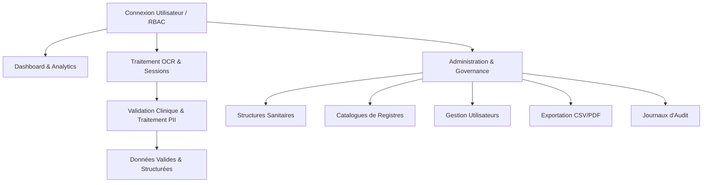

# 👁️ Presentation du Projet OSIRIS Frontend

---

## 📌 1. Présentation Générale & Objectif du Projet

**OSIRIS** (*Système d'Analyse, de Numérisation, d'Extraction OCR et de Validation Clinique des Registres de Santé*) est une plateforme Web moderne dédiée à la **digitalisation, au traitement intelligent par reconnaissance optique de caractères (OCR) et à la validation sécurisée des registres médicaux papier**.

### 💡 Problématique et Cas d'Usage
Dans les établissements de santé (hôpitaux, cliniques, centres de santé), de nombreuses données cliniques sont consignées manuellement sur des registres physiques (registres de maternité, consultations externes, chirurgie, etc.). Ces données papier posent des défis d'archivage, de recherche, de suivi épidémiologique et de confidentialité.

### 🎯 Objectifs Principaux d'OSIRIS
1. **Numérisation et Structuration** : Archiver et structurer les pages scannées des registres médicaux.
2. **Extraction Automatisée par OCR** : Convertir les entrées manuscrites ou imprimées en données numériques exploitables avec calcul automatique de score de confiance.
3. **Validation Clinique à Double Panneau (Split-View)** : Permettre aux validateurs médicaux et agents terrain de réviser, corriger et valider les données extraites en comparant directement l'image originale zoomable et le formulaire de saisie.
4. **Protections des Données Personnelles (PII - Personally Identifiable Information)** : Isoler et sécuriser les cellules contenant des informations identifiantes (anonymisation/recadrage de cellules).
5. **Gouvernance et Traçabilité** : Administrer les structures sanitaires, les catalogues de registres, la gestion des utilisateurs par rôles (RBAC), les exportations de rapports et la conservation de journaux d'audit (*Audit Logs*).

---

## 🛠️ 2. Stack Technique et Outils (Tech Stack)

Le projet repose sur les technologies les plus modernes et performantes de l'écosystème **React & Next.js** (App Router), garantissant rapidité, typage strict et une expérience utilisateur haut de gamme.

### 🌐 Core Framework
- **Next.js 16 (App Router)** : Framework React full-stack offrant le rendu serveur (SSR), le routage dynamique et des performances optimales.
- **React 19** : Bibliothèque d'interface utilisateur de dernière génération.
- **TypeScript 5** : Typage statique strict pour une robustesse maximale du code et des contrats de données.

### 🎨 Design System & Interface Utilisateur
- **Tailwind CSS v4** : Framework CSS utilitaire ultra-rapide pour un styling réactif et sur-mesure.
- **Shadcn/UI & Radix UI** : Composants d'interface accessibles, modulaires et hautement personnalisables (Dialogs, Dropdowns, Selects, Tooltips, Tabs, Popovers, Scroll Area, etc.).
- **Lucide React** : Collection d'icônes vectorielles modernes et cohérentes.
- **Framer Motion** : Moteur d'animation fluide pour les transitions de page, modals d'agrandissement et micro-interactions.
- **Next-Themes** : Gestion fluide du mode sombre et clair.

### 🔄 Gestion de l'État et des Requêtes HTTP
- **TanStack React Query v5** : Gestion avancée du state serveur, mise en cache automatique, rafraîchissement en arrière-plan, retries et gestion fine du chargement/erreurs.
- **Zustand** : Gestion du state global léger côté client (sessions d'authentification, informations de l'utilisateur connecté, états d'interface).
- **Axios & Fetch API (`apiClient.ts`)** : Client HTTP personnalisé centralisé gérant l'URL de base (`NEXT_PUBLIC_API_URL`), l'envoi sécurisé des identifiants/cookies (`credentials: "include"`) et l'interception globale des erreurs (401 Unauthorized, etc.).

### 📝 Formulaires et Validations
- **React Hook Form** : Gestion performante des formulaires sans re-rendus superflus.
- **Zod & `@hookform/resolvers`** : Validation stricte des schémas de données (emails, formulaires de validation clinique, structures, etc.).

### 📊 Visualisation & Traitement de Médias OCR
- **Recharts** : Bibliothèque de graphiques interactifs (BarChart, LineChart, PieChart, AreaChart, Heatmaps d'activité et de performance OCR).
- **TanStack Table v8** : Gestion dynamique et performante des tableaux de données (tri, recherche, pagination, filtres).
- **React Resizable Panels** : Interface à panneaux redimensionnables pour le mode Split-View (Image OCR à gauche / Formulaire de validation à droite).
- **React Zoom Pan Pinch** : Outil interactif pour manipuler les images d'OCR (Zoom, Pan, Rotation).
- **React Photo View** : Aperçu plein écran et galerie pour les images et recadrages PII.

### 🧰 Utilitaires Complémentaires
- **Date-fns** : Manipulation, formattage et comparaison de dates.
- **Sonner** : Système de notifications toasts élégant.
- **CMDK** : Palette de commandes rapide (Ctrl + K).

---

## ⚙️ 3. Fonctionnement & Modules de l'Application



### 🔑 A. Authentification et Rôles (RBAC)
L'application sécurise l'accès en fonction des rôles utilisateur définis :
- `AGENT_TERRAIN` : Chargé de la numérisation, du téléversement et du premier niveau de vérification.
- `VALIDEUR_MEDICAL` : Praticien ou expert médical validant l'exactitude clinique des données extraites.
- `ADMIN` : Gestionnaire de la structure sanitaire, des catalogues et des équipes.
- `SUPERADMIN` : Administrateur système ayant un accès global.

### 📊 B. Dashboard & Analytique
Le tableau de bord principal fournit un centre de pilotage en temps réel :
- **KPIs de Performance** : Taux d'extraction OCR réussi, score de confiance moyen, volume de registres traités, temps moyen de validation.
- **Graphiques Interactifs** :
  - Volumes de traitement dans le temps.
  - Distribution des statuts de validation (*Pending, Validated, Rejected, Anomaly*).
  - Score de confiance OCR et efficacité des algorithmes.
  - Heatmap d'activité globale et par opérateur.
  - Comparatif d'efficacité et de précision des opérateurs.
- **Mode Focus** : Possibilité d'agrandir chaque graphique en plein écran grâce aux modals Framer Motion pour une analyse détaillée.

### 📄 C. Traitement OCR & Numérisation (`/dashboard/ocr-processing`)
- Importation et organisation des scans de registres sous forme de sessions / lots (*batches*).
- Pré-traitement automatique et extraction des cellules de texte par le moteur OCR backend.
- Détection automatique des anomalies et calcul d'un score de confiance global et par champ.

### 🔍 D. Validation Clinique & Cellules PII (`/dashboard/data-validation`)
- **Vue par Dossiers & Table Détaillée** : Filtrage rapide par statut (*Pending, Validated, Rejected, Anomaly*), recherche textuelle et sélection de sessions.
- **Interface de Validation Avancée (`/dashboard/data-validation/[id]`)** :
  - **Panneau Image** : Affichage haute résolution de la page scannée avec zoom, rotation et déplacement pour vérifier l'écriture manuscrite.
  - **Panneau Formulaire** : Formulaire dynamique basé sur le modèle de registre correspondant.
  - **Recadrage PII (Personally Identifiable Information)** : Isolation et validation séparée des champs identifiants pour garantir la confidentialité médicale.
  - **Chronologie de Traitement (*Processing Timeline*)** : Suivi de toutes les étapes franchies par le lot (Upload, OCR, PII Review, Clinical Validation, Completed).

### 🏛️ E. Administration & Governance (`/dashboard/admin`)
1. **Structures Sanitaires (`/dashboard/admin/structures`)** : Création et gestion des établissements de santé et districts sanitaires rattachés.
2. **Catalogues de Registres (`/dashboard/admin/catalogues`)** : Configuration des types de registres médicaux (ex: *Registre d'Accouchement, Registre de Consultation Externe*), versioning par année, découpage en sections et champs.
3. **Gestion des Utilisateurs (`/dashboard/admin/users`)** : Gestion des comptes, attribution des rôles et contrôle des accès.
4. **Exportation des Données (`/dashboard/admin/exports`)** : Génération d'exports structurés aux formats **CSV** ou **PDF** filtrés par structure, type de registre ou plage de dates.
5. **Journaux d'Audit (`/dashboard/activity-log`)** : Traçabilité complète et immuable de chaque action effectuée (qui, quoi, quand, depuis quelle IP) garantissant le respect des normes de sécurité médicale et du RGPD.

---

## 📁 4. Architecture des Dossiers

L'arborescence du projet suit les meilleures pratiques de **Clean Architecture Frontend** :

```text
osiris_front/
├── public/                  # Assets statiques et images
├── src/
│   ├── app/                 # Pages et routes Next.js (App Router)
│   │   ├── page.tsx         # Page d'accueil / Connexion
│   │   └── dashboard/       # Espace de travail connecté
│   │       ├── page.tsx     # Tableau de bord principal
│   │       ├── ocr-processing/    # Module de numérisation & OCR
│   │       ├── data-validation/   # Module de validation clinique & PII
│   │       │   └── [id]/          # Vue détaillée de validation d'un lot
│   │       ├── admin/             # Espace administration
│   │       │   ├── users/         # Gestion des utilisateurs
│   │       │   ├── structures/    # Structures sanitaires
│   │       │   ├── catalogues/    # Catalogues de registres
│   │       │   └── exports/       # Exportations de données
│   │       ├── activity-log/      # Journaux d'audit
│   │       └── settings/          # Paramètres de compte
│   ├── components/          # Composants React
│   │   ├── ui/              # Composants génériques Shadcn / Radix
│   │   ├── layout/          # Composants de mise en page (Sidebar, Header)
│   │   └── features/        # Composants métiers
│   │       ├── auth/        # Formulaires & visuels d'authentification
│   │       ├── dashboard/   # Graphiques et cartes KPI
│   │       └── data-validation/ # Tableaux de détails & Popups de validation OCR
│   ├── services/            # Services de communication avec l'API Backend REST
│   │   ├── apiClient.ts     # Wrapper Fetch / Axios centralisé
│   │   ├── auth.service.ts  # Service Authentification
│   │   ├── dashboard.service.ts # Service Métriques & Stats
│   │   ├── sessions.service.ts  # Service Sessions OCR & Pages
│   │   ├── donnees-extraites.service.ts # Service Données extraites
│   │   ├── pii-cellules.service.ts      # Service Cellules PII
│   │   ├── structures.service.ts       # Service Structures Sanitaires
│   │   ├── catalogues.service.ts       # Service Catalogues de registres
│   │   ├── users.service.tsx           # Service Utilisateurs
│   │   ├── exports.service.ts          # Service Exportations
│   │   └── audit.service.ts            # Service Logs d'audit
│   ├── store/               # State global (Zustand)
│   │   └── authStore.ts     # Store Authentification & Session Utilisateur
│   ├── types/               # Déclarations et interfaces TypeScript
│   │   └── index.ts         # Modèles de données (User, DonneeExtraite, PiiCellule, etc.)
│   └── lib/                 # Fonctions utilitaires partagées (`cn`, etc.)
├── Library_context.md       # Charte et règles d'utilisation des bibliothèques
├── package.json             # Dépendances et scripts du projet
├── next.config.ts           # Configuration Next.js
└── Presentation.md          # Ce document de présentation
```

---

## 📜 5. Conventions & Directives de Développement

Afin de garantir la cohérence et la maintenabilité du projet, les règles suivantes sont appliquées (`Library_context.md`) :

1. **Priorité Shadcn/UI & Radix UI** : Réutiliser systématiquement les composants Shadcn avant de créer un élément sur-mesure.
2. **State Serveur via TanStack React Query** : Interdiction d'utiliser `useEffect` pour charger des données de l'API. Utiliser exclusivement `useQuery()` et `useMutation()`.
3. **Client API Unifié (`apiClient.ts`)** : Tous les appels HTTP passent par l'instance client centralisée avec gestion automatique des tokens et erreurs.
4. **Formulaires Typés avec Zod & React Hook Form** : Tous les formulaires sont validés par des schémas Zod reliés à React Hook Form.
5. **State Global Restreint (Zustand)** : Reservé uniquement aux états globaux légers (utilisateur connecté, thème, sidebar). Les données métier restent dans le cache React Query.
6. **Visualisation Exclusive Recharts** : Tous les graphiques sont construits avec Recharts.

---

## 🚀 6. Guide de Démarrage Rapide

### Prérequis
- **Node.js** v18+ 
- **npm** / **yarn** / **pnpm**

### Installation et Lancement

1. **Cloner le dépôt et installer les dépendances** :
   ```bash
   npm install
   ```

2. **Configurer les variables d'environnement** (`.env.local`) :
   ```env
   NEXT_PUBLIC_API_URL=http://localhost:8000/api
   ```

3. **Lancer le serveur de développement** :
   ```bash
   npm run dev
   ```

4. **Accéder à l'application** :  
   Ouvrir [http://localhost:3000](http://localhost:3000) dans votre navigateur.

---

*Document généré pour la présentation du projet OSIRIS Frontend.*
